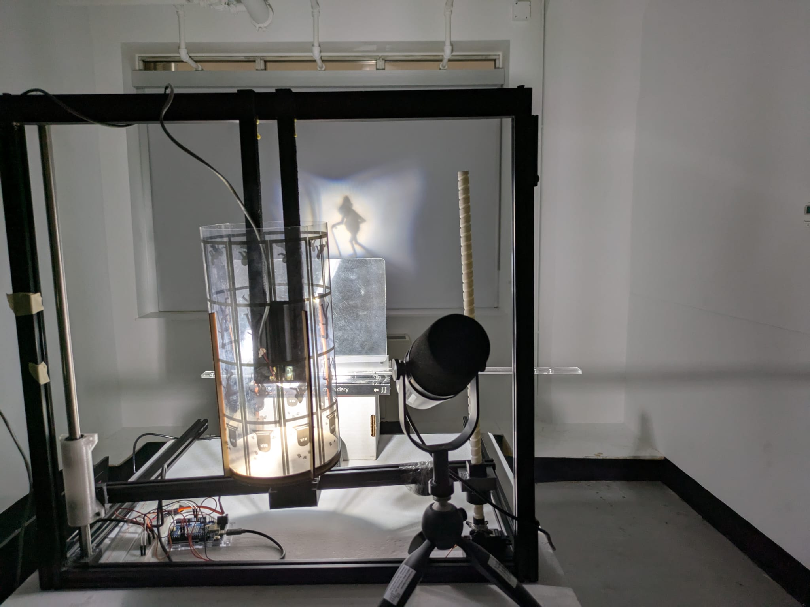
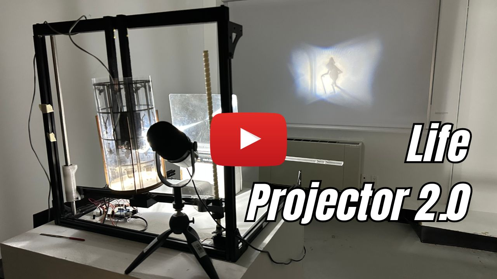

# Life Projector 2.0

We redesigned our **Life Projector** as a full‑size zoetrope for the **DIGF Experiences & Interfaces** course (Assignment: **IMMERSION**).

Instead of sliding shadow frames, a spinning drum—rebuilt from old 3D‑printer Z‑axis parts—carries four silhouettes of human life:

1. **Baby**  
2. **Adult**  
3. **Old Age**  
4. **Death**



A fixed bulb and Fresnel lens cast each frame onto a screen. A motorized Z‑axis platform lifts the drum to select which stage is in view.

---

## Installation & Usage
Watch the video on YouTube🎥 👇👇

[](https://youtu.be/aB5X_Zo3m3g)

Or use this link to open the video on YT: [https://youtu.be/aB5X_Zo3m3g](https://youtu.be/aB5X_Zo3m3g)

---

## How It Works

1. **Story‑Driven Interaction**  
   - The user reads aloud an incomplete script with blanks to fill in four scripted passages—each stanza tied to a life stage.  
   - A speech‑recognition program listens for keywords (`baby`, `young`, `elder`, `demise`) and identifies the current stage.

2. **Voice → Motion**  
   - Python (`voice_servo_control.py`) sends a `MOVE:current:target` command over serial.  
   - The Arduino (`Test2_CntServo_LmtSwitch.ino`) moves the reclaimed Z‑axis stepper to the new “stop” (stage).

3. **Kinetic Projection**  
   - As the drum spins under the lamp, lifting it brings the next silhouette into focus.  
   - Simultaneously, stage‑specific audio loops via Pygame enrich the experience.

---

## Hardware Components

- **Arduino Uno R4 WiFi**  
- **Reclaimed 3D‑printer Z‑axis parts** (linear rails, limit switches, Aluminium extrusions)  
- **3D‑printed drum mounts, servo mounts, worm and screw drive mechanism & frame brackets**  
- **Light bulb & Fresnel lens**  
- **2x Continuous 360 Servo Motors**
- **USB microphone** & **Mac/PC**  

---

## Software Setup

1. **Arduino**  
   - Open `Test2_CntServo_LmtSwitch.ino` in Arduino IDE.  
   - Upload to your Uno R4 WiFi.  

2. **Python Environment**  
   ```bash
   pip install pyserial SpeechRecognition pygame

3. **Run the Voice Controller**
   ```bash
   python voice_servo_control.py

---

## Contributors

- **Ishgun Lambha**
- **Kunal Devi**
- **Simerneet Singh**